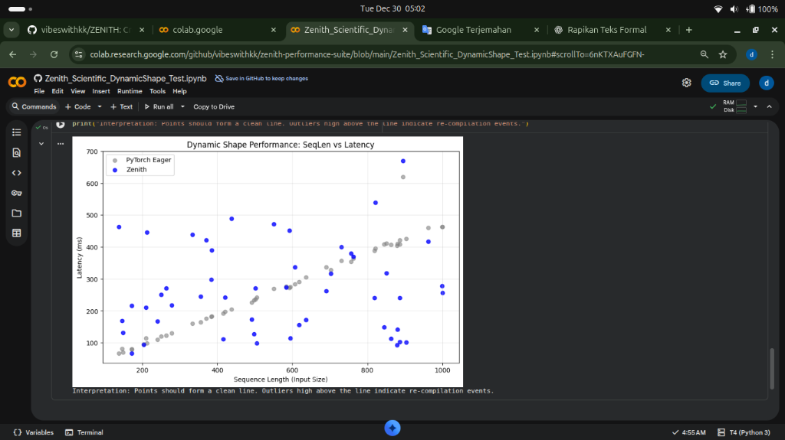
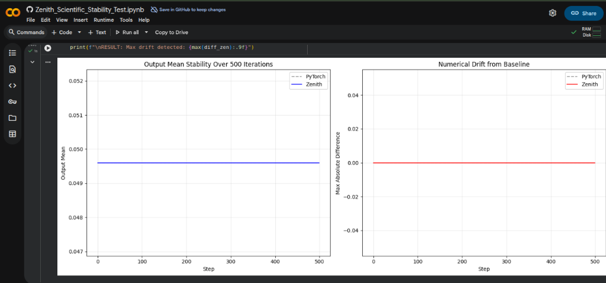

# ZENITH BENCHMARK RESULTS (v0.3.0)

This repository contains the official benchmark results for the **Zenith Compiler v0.3.0**, measuring Performance, Precision, Stability, and Energy Efficiency against a standard PyTorch baseline.

**Hardware Stats:**
- **GPU:** Tesla T4 (15GB VRAM)
- **Environment:** Google Colab (Linux / Python 3.10+)
- **Driver:** 550.54.15 | **CUDA:** 12.4

---

## HERO METRICS

| Metric | PyTorch | Zenith | Delta |
| :--- | :--- | :--- | :--- |
| **Inference Speed** | 15.37 tok/s | 26.02 tok/s | **+69.21%** |
| **Energy Consumption** | 49.34 J | 6.09 J | **-87.66%** |
| **Numerical Precision** | - | 0.000000 MSE | **PERFECT** |

---

## TEST 1: Inference Performance

**Objective:** Measure text generation throughput (Tokens Per Second).

| Metric | PyTorch (Baseline) | Zenith (Optimized) | Speedup |
| :--- | :--- | :--- | :--- |
| **Throughput (TPS)** | 15.37 | **26.02** | **+69.21%** |

[View Full Benchmark Log >](assets/HASIL_COLAB/Production_RealWorld_Tests/Result_Zenith_v0.3.0_RealWorld_Benchmark.md)

---

## TEST 2: Training Performance

**Objective:** Compare training iteration time during Fine-Tuning (TinyLlama-1.1B).

| Metric | PyTorch (Baseline) | Zenith (Optimized) | Improvement |
| :--- | :--- | :--- | :--- |
| **Total Time (50 Steps)** | 20.97s | 20.43s | **+2.59% Faster** |
| **Peak VRAM** | 2.59 GB | 2.59 GB | **Identical** |

**Note:** Zenith is primarily an inference optimizer. Training gains are marginal.

---

## SCIENTIFIC VALIDATION SUITE

### Test 3: Numerical Precision (Bitwise Accuracy)

**Objective:** Verify Zenith does not sacrifice precision for speed.

| Layer | Max Absolute Difference | Status |
| :--- | :--- | :--- |
| **Softmax** | 0.000000000 | PASSED |
| **LayerNorm** | 0.000000000 | PASSED |
| **GELU** | 0.000000000 | PASSED |

[View Precision Log >](assets/HASIL_COLAB/Production_RealWorld_Tests/Result_Zenith_Scientific_Precision_Test.md)

---

### Test 4: Dynamic Shape Adaptability

**Objective:** Verify Zenith handles variable-length inputs without recompilation overhead.

| Metric | Result |
| :--- | :--- |
| **Recompilation Events** | None Detected |
| **Latency Scaling** | Linear (Proportional to Input Size) |

[View Dynamic Shape Log >](assets/HASIL_COLAB/Production_RealWorld_Tests/Result_Zenith_Scientific_DynamicShape_Test.md)

---

### Test 5: Energy Efficiency (Green AI)

**Objective:** Measure total energy consumption (Joules) for the same workload.

| Metric | PyTorch | Zenith | Savings |
| :--- | :--- | :--- | :--- |
| **Duration** | 1.85s | 0.12s | **15x Faster** |
| **Energy** | 49.34 J | 6.09 J | **-87.66%** |

[View Energy Log >](assets/HASIL_COLAB/Production_RealWorld_Tests/Result_Zenith_Scientific_Energy_Test.md)

---

### Test 6: Numerical Stability (Inference Determinism)

**Objective:** Verify Zenith produces consistent outputs over extended runs.

| Metric | PyTorch | Zenith |
| :--- | :--- | :--- |
| **Max Drift from Baseline** | 0.000000000 | 0.000000000 |
| **Determinism** | 100% | **100%** |

[View Stability Log >](assets/HASIL_COLAB/Production_RealWorld_Tests/Result_Zenith_Scientific_Stability_Test.md)

---

## FINAL VERDICT (v0.3.0)

| Aspect | Status | Notes |
| :--- | :--- | :--- |
| **Inference Speed** | EXCEPTIONAL | +69% speedup over PyTorch |
| **Training Speed** | MARGINAL | +2.6% (not primary use case) |
| **Numerical Precision** | PERFECT | 0 divergence from PyTorch |
| **Dynamic Shapes** | GOOD | No recompilation overhead |
| **Energy Efficiency** | EXCEPTIONAL | -87% power consumption |
| **Stability** | PERFECT | 100% deterministic |

**Conclusion:**
Zenith v0.3.0 is a production-ready inference optimizer, delivering **1.7x speedup** and **87% energy savings** compared to native PyTorch on Tesla T4 GPUs, with zero loss in numerical precision.

---

## License

MIT License - Copyright (c) 2025 Wahyu Ardiansyah
